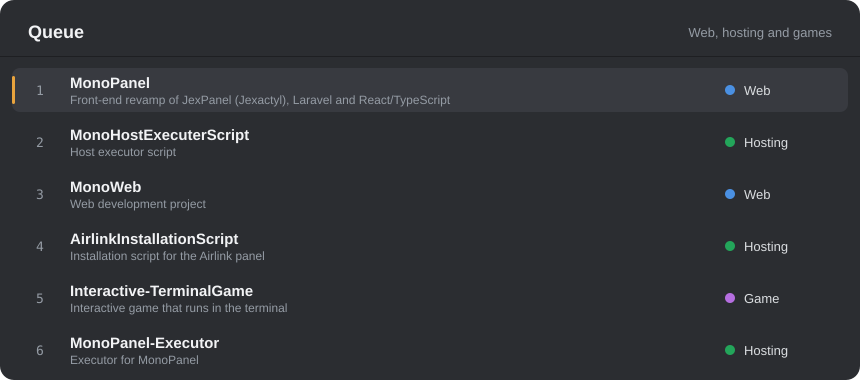

## About me

I build Discord bots and websites: bots, hosting panels, install scripts and a few games. I like taking an existing project apart, learning how it works, and shipping my own version of it.

## Stack

## GitHub stats

<!-- Add your Discord username or server invite here so people can reach you. -->
